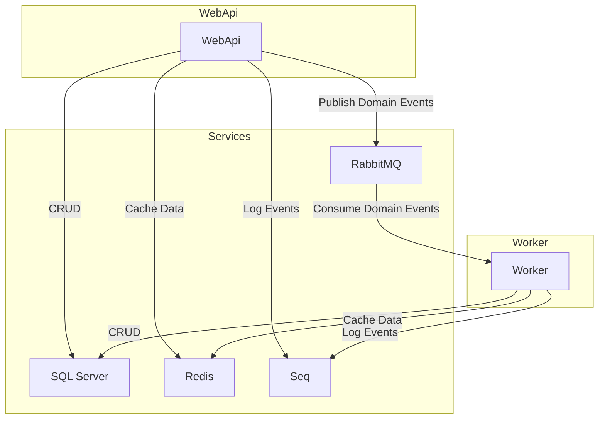

# The Background Experience

This is an example of a WebApi (`TheBackgroundExperience.WebApi`) which is built using the [Clean Architecture](https://github.com/ardalis/CleanArchitecture) principles.
The WebApi can modify data (CRUD operations) in a [database](https://hub.docker.com/r/microsoft/mssql-server) using [Entity Framework Core](https://learn.microsoft.com/en-us/ef/core/).
Then domain events are published to a message broker ([RabbitMQ](https://www.rabbitmq.com/)).
The `TheBackgroundExperience.Worker` project is a worker service that consumes these domain events and processes them.
There is also another layer for ~~~~caching data using [Redis](https://hub.docker.com/_/redis) via [FusionCache](https://github.com/ZiggyCreatures/FusionCache).
Both applications are logging events via [Serilog](https://serilog.net/) to a [Seq](https://datalust.co/seq) server for structured logging.

It is a learning project to get familiar with the technologies and patterns used in modern .NET applications.
I have read a lot about different approaches and patterns, but I wanted to try them out myself.
This project is not meant to be a production-ready application, but rather a starting point for further development.
There will always be room for improvement and optimization and it is never meant to be perfect.
Different scenarios and requirements will lead to different implementations, so this is just one way to do it.

Keep in mind that this is a simplified example and does not cover all aspects of a real-world application, 
although I want to try to fill in all those gaps.

## Architecture



## Getting Started

This project is just a starting point for a more complex application.
To keep it simple and directly runnable, I intended to check in configuration which contains otherwise sensitive information.
This is not recommended for production applications, but it is useful for development and testing purposes.

_The password is the same for all services running in docker and can be found in the `appsettings.json` or `docker-compose.yml` files_

**Please never check in sensitive information into a public repository!**

### Prerequisites

- [.NET 9 SDK](https://dotnet.microsoft.com/download/dotnet/9.0)
- [Docker](https://www.docker.com/get-started)

### Running the Application

```bash
docker compose up -d
```

This will start a new network with the following services:
  - `mssql`: The SQL Server database. (localhost, 1433)
  - `rabbitmq`: The RabbitMQ message broker. (http://localhost:15672/)
  - `redis`: The Redis cache. (localhost, 6379)
  - `seq`: The Seq logging server. (http://localhost:5341/)
  - `webapi`: The WebApi application. (http://localhost:5000/)
  - `worker`: The worker service that consumes domain events. 

The first start of the applications will also create the database if it does not yet exist.
But no migrations will be applied (for now), so make sure to delete the database if you want to change something in the entities / schema, and restart either the `worker` or the `webapi`.

To use `Seq` you can access it at http://localhost:5341, use the predefined credentials and create an API key.
Update the appsettings.{env}.json files in the `WebApi` and `Worker` projects with the API key inside the `Serilog:WriteTo` => `Seq` configuration.

The development environment uses `localhost` to access the services running in the Docker container (`appsettings.Development.json`).
In production, you should use the service names defined in the `docker-compose.yml` file (see `appsettings.json`).

### Further Development

#### WebApi

- Authentication and Authorization
- Validation
- More granular error handling

#### Worker

- Error handling
- Retry logic

#### Infrastructure

- Database [migrations](https://learn.microsoft.com/en-us/ef/core/cli/dotnet#dotnet-ef-migrations-add) `dotnet ef migrations add`
- Database performance [optimizations](https://learn.microsoft.com/en-us/ef/core/cli/dotnet#dotnet-ef-dbcontext-optimize) `dotnet ef dbcontext optimize`
- Database seeding (currently empty)

#### Client

- A client application to interact with the WebApi (possibly [Angular](https://angular.dev/))
- Can be hosted inside an ASP.NET Core application or as a separate application

#### General

- Notifications between WebApi, Worker and Client (e.g. via [SignalR](https://dotnet.microsoft.com/en-us/apps/aspnet/signalr))
- Unit tests
- Integration tests
- End-to-end tests