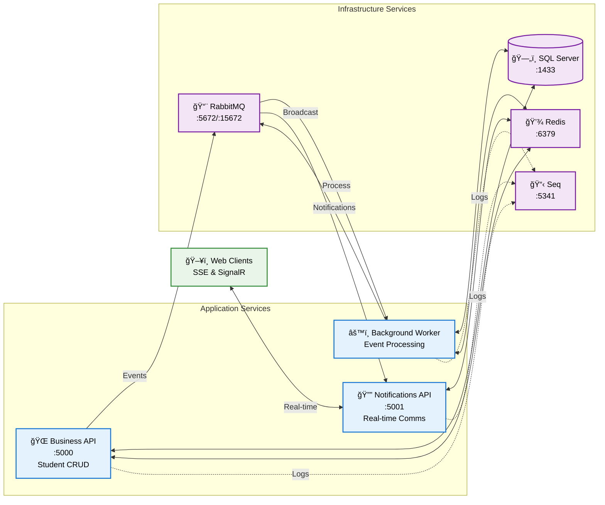

# The Background Experience

A .NET 9 **Clean Architecture** demonstration project showcasing a modern microservices architecture with **dual real-time notification system**. This solution demonstrates event-driven communication patterns between microservices with comprehensive real-time client notifications.

## 🎯 Main Purpose

This project demonstrates:
- **Event-Driven Architecture**: Domain events published via RabbitMQ for loose coupling between services
- **Real-Time Communications**: Dual notification system using both Server-Sent Events (SSE) and SignalR
- **Microservices Pattern**: Dedicated services for business logic, background processing, and real-time communications
- **Clean Architecture**: Separation of concerns with Domain, Application, Infrastructure, and Presentation layers
- **Modern .NET Patterns**: CQRS with Mediator, distributed caching, and structured logging
- **Enterprise Resilience**: Connection pooling, circuit breakers, retry policies, and health monitoring
- **Request Optimization**: Request deduplication middleware and coalescing strategies for high-load scenarios

## 🏗️ Architecture Overview

The solution consists of **three main services**:

1. **Business WebAPI** (`TheBackgroundExperience.WebApi`): Core CRUD operations for students
2. **Background Worker** (`TheBackgroundExperience.Worker`): Processes domain events and manages background tasks
3. **Notifications Service** (`TheBackgroundExperience.NotificationsApi`): Dedicated real-time communication service

**Supporting Infrastructure:**
- **Database**: SQL Server with Entity Framework Core for data persistence
- **Message Broker**: RabbitMQ for event-driven communication
- **Caching**: Redis with FusionCache for distributed caching and SignalR backplane
- **Logging**: Serilog with Seq server for structured logging

This is a learning project to explore modern .NET application patterns and technologies. While not production-ready, it serves as a comprehensive starting point for understanding microservices architecture and real-time communication patterns.

## 🔄 System Architecture



## 🚀 Event-Driven Workflow

This diagram shows the complete flow from a student operation to real-time client notifications:

```mermaid
flowchart TD
    %% Step 1: Client Request
    START([🖥️ Client Request<br/>POST/PUT Student]) 
    
    %% Step 2: Business API Processing
    API[🌐 Business API<br/>Process CRUD]
    DB_SAVE[💾 Save to Database]
    DOMAIN_EVENT[⚡ Raise Domain Event<br/>StudentCreated/Updated]
    
    %% Step 3: Event Publishing
    PUB_EVENT[📤 Publish Event<br/>RabbitMQ]
    RESPONSE[📨 HTTP Response<br/>200/201 to Client]
    
    %% Step 4: Background Processing  
    CONSUME_EVENT[📥 Worker Consumes<br/>Domain Event]
    BG_PROCESS[⚙️ Background Processing<br/>Cache Updates, Validation]
    
    %% Step 5: Notification Publishing
    PUB_NOTIFY[📤 Publish Notification<br/>student.created/updated/cached/deleted]
    
    %% Step 6: Real-time Distribution
    CONSUME_NOTIFY[📥 Notifications API<br/>Consumes Event]
    
    subgraph REALTIME [" Real-time Broadcast "]
        direction LR
        SSE[📡 Server-Sent Events<br/>/api/notifications/stream]
        SIGNALR[⚡ SignalR Hub<br/>/hubs/notifications]
    end
    
    CLIENTS[🖥️ Connected Clients<br/>Receive Updates]

    %% Flow connections
    START --> API
    API --> DB_SAVE
    API --> DOMAIN_EVENT
    DOMAIN_EVENT --> PUB_EVENT
    PUB_EVENT --> RESPONSE
    PUB_EVENT --> CONSUME_EVENT
    CONSUME_EVENT --> BG_PROCESS
    BG_PROCESS --> PUB_NOTIFY
    PUB_NOTIFY --> CONSUME_NOTIFY
    CONSUME_NOTIFY --> SSE
    CONSUME_NOTIFY --> SIGNALR
    SSE --> CLIENTS
    SIGNALR --> CLIENTS

    %% Styling
    classDef startEnd fill:#4caf50,stroke:#2e7d32,stroke-width:2px,color:#fff
    classDef process fill:#2196f3,stroke:#1565c0,stroke-width:2px,color:#fff
    classDef event fill:#ff9800,stroke:#ef6c00,stroke-width:2px,color:#fff
    classDef realtime fill:#9c27b0,stroke:#6a1b9a,stroke-width:2px,color:#fff
    
    class START,CLIENTS startEnd
    class API,DB_SAVE,BG_PROCESS,RESPONSE process
    class DOMAIN_EVENT,PUB_EVENT,CONSUME_EVENT,PUB_NOTIFY,CONSUME_NOTIFY event
    class SSE,SIGNALR realtime
```



## 🛡️ Resilience & Performance Architecture

The application implements enterprise-grade resilience patterns and performance optimizations:

```mermaid
flowchart TB
    %% Client Request Flow
    CLIENT[🖥️ Client Request]
    
    %% Request Deduplication Layer
    subgraph MIDDLEWARE [" Request Processing Middleware "]
        direction TB
        DEDUPE[🔄 Request Deduplication<br/>Coalesces identical requests<br/>Configurable cache duration]
        DEDUP_CACHE[(⚡ In-Memory Cache<br/>Request fingerprints<br/>Response caching)]
        DEDUPE --> DEDUP_CACHE
    end
    
    %% Business Layer
    API[🌐 Business API<br/>Student Controllers]
    
    %% Infrastructure Resilience Layer
    subgraph RESILIENCE [" Infrastructure Resilience "]
        direction TB
        POOL[🏊 RabbitMQ Connection Pool<br/>Max 3 connections<br/>Max 5 channels per connection]
        CIRCUIT[⚡ Circuit Breakers<br/>Polly resilience patterns<br/>Auto-recovery]
        RETRY[🔄 Retry Policies<br/>Exponential backoff<br/>Jitter strategies]
        HEALTH[💓 Health Checks<br/>Database, RabbitMQ, Redis<br/>Continuous monitoring]
        
        POOL --> CIRCUIT
        CIRCUIT --> RETRY
        RETRY --> HEALTH
    end
    
    %% Infrastructure Services
    subgraph INFRA [" Infrastructure Services "]
        direction LR
        DB[(🗄️ SQL Server)]
        MQ[📨 RabbitMQ<br/>FIFO queues<br/>PrefetchCount: 1]
        REDIS[💾 Redis<br/>Distributed cache<br/>SignalR backplane]
    end
    
    %% Worker Processing
    WORKER[⚙️ Background Worker<br/>Sequential processing<br/>Connection pooling]

    %% Flow connections
    CLIENT --> DEDUPE
    DEDUPE --> API
    API --> POOL
    POOL --> MQ
    POOL --> DB
    POOL --> REDIS
    MQ --> WORKER
    WORKER --> POOL
    HEALTH -.-> DB
    HEALTH -.-> MQ
    HEALTH -.-> REDIS

    %% Styling
    classDef client fill:#4caf50,stroke:#2e7d32,stroke-width:2px,color:#fff
    classDef middleware fill:#ff9800,stroke:#ef6c00,stroke-width:2px,color:#fff
    classDef resilience fill:#2196f3,stroke:#1565c0,stroke-width:2px,color:#fff
    classDef infrastructure fill:#9c27b0,stroke:#6a1b9a,stroke-width:2px,color:#fff
    classDef worker fill:#795548,stroke:#5d4037,stroke-width:2px,color:#fff
    
    class CLIENT client
    class DEDUPE,DEDUP_CACHE middleware
    class POOL,CIRCUIT,RETRY,HEALTH resilience
    class DB,MQ,REDIS infrastructure
    class API,WORKER worker
```



## 🏛️ Clean Architecture Dependencies

This diagram shows the dependency relationships between the main architectural layers:

```mermaid
flowchart TD
    %% Presentation Layer
    subgraph PRESENTATION [" 🖥️ Presentation Layer "]
        direction TB
        WEBAPI[TheBackgroundExperience.WebApi<br/>Controllers, Middleware]
        WORKER[TheBackgroundExperience.Worker<br/>Background Services]
        NOTIFY[TheBackgroundExperience.NotificationsApi<br/>Real-time Communications]
    end
    
    %% Application Layer
    subgraph APPLICATION [" 📋 Application Layer "]
        direction TB
        APP_CORE[TheBackgroundExperience.Application<br/>CQRS Commands/Queries<br/>Domain Event Handlers<br/>Business Logic]
        
        subgraph APP_FEATURES [" Feature Modules "]
            STUDENTS[👨‍🎓 Students<br/>Commands, Queries<br/>Event Handlers]
            CACHING[💾 Caching<br/>Behaviors, Policies]
            CONFIG[⚙️ Configuration<br/>Options, Settings]
        end
        
        APP_CORE --> STUDENTS
        APP_CORE --> CACHING  
        APP_CORE --> CONFIG
    end
    
    %% Domain Layer
    subgraph DOMAIN [" 🏛️ Domain Layer "]
        direction TB
        ENTITIES[📝 Entities<br/>Student, BaseEntity]
        EVENTS[⚡ Domain Events<br/>StudentCreated, StudentUpdated<br/>CacheStudentEvent]
        INTERFACES[🔌 Interfaces<br/>ICachable, Repository Contracts]
        COMMON[🔧 Common<br/>Caching Keys, Base Classes]
        
        ENTITIES --> EVENTS
        ENTITIES --> INTERFACES
        COMMON --> INTERFACES
    end
    
    %% Infrastructure Layer  
    subgraph INFRASTRUCTURE [" 🔧 Infrastructure Layer "]
        direction TB
        PERSISTENCE[🗄️ Persistence<br/>DbContext, Repositories<br/>Entity Configurations]
        MESSAGING[📨 Messaging<br/>RabbitMQ Connection Pool<br/>Queue Management]
        CACHING_INFRA[💾 Caching<br/>Redis, FusionCache<br/>Distributed Caching]
        RESILIENCE_INFRA[🛡️ Resilience<br/>Circuit Breakers<br/>Health Checks]
        
        PERSISTENCE --> MESSAGING
        MESSAGING --> CACHING_INFRA
        CACHING_INFRA --> RESILIENCE_INFRA
    end

    %% Dependencies (Clean Architecture Rules)
    PRESENTATION --> APPLICATION
    APPLICATION --> DOMAIN
    INFRASTRUCTURE --> DOMAIN
    INFRASTRUCTURE --> APPLICATION

    %% Styling
    classDef presentation fill:#4caf50,stroke:#2e7d32,stroke-width:2px,color:#fff
    classDef application fill:#2196f3,stroke:#1565c0,stroke-width:2px,color:#fff
    classDef domain fill:#ff9800,stroke:#ef6c00,stroke-width:2px,color:#fff
    classDef infrastructure fill:#9c27b0,stroke:#6a1b9a,stroke-width:2px,color:#fff
    
    class WEBAPI,WORKER,NOTIFY presentation
    class APP_CORE,STUDENTS,CACHING,CONFIG application
    class ENTITIES,EVENTS,INTERFACES,COMMON domain
    class PERSISTENCE,MESSAGING,CACHING_INFRA,RESILIENCE_INFRA infrastructure
```



## 🔗 Key Component Dependencies

This diagram shows the critical runtime dependencies between major components:

```mermaid
flowchart LR
    %% Controllers
    subgraph CONTROLLERS [" 🎮 Controllers "]
        STUDENT_CTRL[StudentController<br/>@DeduplicateRequest]
    end
    
    %% Middleware
    subgraph MIDDLEWARE [" 🔄 Middleware "]
        REQ_DEDUPE[RequestDeduplicationMiddleware<br/>Response caching<br/>Request fingerprinting]
    end
    
    %% CQRS Layer
    subgraph CQRS [" 📋 CQRS Layer "]
        MEDIATOR[IMediator<br/>Command/Query dispatcher]
        COMMANDS[Commands<br/>CreateStudent<br/>UpdateStudent]
        QUERIES[Queries<br/>GetStudentById<br/>Cache integration]
        HANDLERS[Event Handlers<br/>StudentCreated<br/>StudentUpdated]
    end
    
    %% Infrastructure Services
    subgraph INFRA_SERVICES [" 🔧 Infrastructure Services "]
        CONNECTION_POOL[RabbitMqConnectionPool<br/>3 connections<br/>5 channels each<br/>Health monitoring]
        RESILIENCE[ResiliencePipelineFactory<br/>Circuit breakers<br/>Retry policies<br/>Timeout handling]
        QUEUE_MGR[QueueManager<br/>Message publishing<br/>Queue declarations]
        CACHE_SERVICE[FusionCache<br/>Redis backplane<br/>Memory + distributed]
    end
    
    %% Data Layer
    subgraph DATA [" 🗄️ Data Layer "]
        DBCONTEXT[ApplicationDbContext<br/>Entity tracking<br/>Event dispatching]
        INTERCEPTOR[DispatchEventsInterceptor<br/>Domain event processing]
    end
    
    %% Worker Services
    subgraph WORKERS [" ⚙️ Background Workers "]
        QUEUE_WORKER[StudentQueueWorker<br/>Sequential processing<br/>PrefetchCount: 1]
        WORKER_BASE[QueueWorkerBase<br/>Connection pooling<br/>Error handling]
    end

    %% Dependencies
    STUDENT_CTRL --> MEDIATOR
    REQ_DEDUPE --> STUDENT_CTRL
    MEDIATOR --> COMMANDS
    MEDIATOR --> QUERIES
    COMMANDS --> HANDLERS
    HANDLERS --> QUEUE_MGR
    QUEUE_MGR --> CONNECTION_POOL
    CONNECTION_POOL --> RESILIENCE
    QUERIES --> CACHE_SERVICE
    COMMANDS --> DBCONTEXT
    DBCONTEXT --> INTERCEPTOR
    INTERCEPTOR --> HANDLERS
    QUEUE_WORKER --> WORKER_BASE
    WORKER_BASE --> CONNECTION_POOL

    %% Styling
    classDef controller fill:#4caf50,stroke:#2e7d32,stroke-width:2px,color:#fff
    classDef middleware fill:#ff9800,stroke:#ef6c00,stroke-width:2px,color:#fff
    classDef cqrs fill:#2196f3,stroke:#1565c0,stroke-width:2px,color:#fff
    classDef infrastructure fill:#9c27b0,stroke:#6a1b9a,stroke-width:2px,color:#fff
    classDef data fill:#795548,stroke:#5d4037,stroke-width:2px,color:#fff
    classDef worker fill:#607d8b,stroke:#455a64,stroke-width:2px,color:#fff
    
    class STUDENT_CTRL controller
    class REQ_DEDUPE middleware
    class MEDIATOR,COMMANDS,QUERIES,HANDLERS cqrs
    class CONNECTION_POOL,RESILIENCE,QUEUE_MGR,CACHE_SERVICE infrastructure
    class DBCONTEXT,INTERCEPTOR data
    class QUEUE_WORKER,WORKER_BASE worker
```

## Getting Started

This project is just a starting point for a more complex application.
To keep it simple and directly runnable, I intended to check in configuration which contains otherwise sensitive information.
This is not recommended for production applications, but it is useful for development and testing purposes.

_The password is the same for all services running in docker and can be found in the `appsettings.json` or `docker-compose.yml` files_

**Please never check in sensitive information into a public repository!**

### Prerequisites

- [.NET 9 SDK](https://dotnet.microsoft.com/download/dotnet/9.0)
- [Docker](https://www.docker.com/get-started)

### Running the Application

```bash
docker compose up -d
```

This will start a new network with the following services:
  - `db`: The SQL Server database. (localhost, 1433)
  - `rabbitmq`: The RabbitMQ message broker. (http://localhost:15672/)
  - `redis`: The Redis cache. (localhost, 6379)
  - `seq`: The Seq logging server. (http://localhost:5341/)
  - `webapi`: The Business WebAPI application. (http://localhost:5000/)
  - `worker`: The background worker service that processes domain events.
  - `notifications`: The Notifications API service with real-time communications. (http://localhost:5001/) 

The first start of the applications will also create the database if it does not yet exist.
But no migrations will be applied (for now), so make sure to delete the database if you want to change something in the entities / schema, and restart either the `worker` or the `webapi`.

To use `Seq` you can access it at http://localhost:5341, use the predefined credentials and create an API key.
Update the appsettings.{env}.json files in the `WebApi` and `Worker` projects with the API key inside the `Serilog:WriteTo` => `Seq` configuration.

The development environment uses `localhost` to access the services running in the Docker container (`appsettings.Development.json`).
In production, you should use the service names defined in the `docker-compose.yml` file (see `appsettings.json`).

### 🔔 Testing Real-Time Notifications

After starting all services, you can test the real-time notification system:

1. **Access Test Pages** (served by NotificationsApi):
   - **Landing Page**: http://localhost:5001/
   - **SSE Test**: http://localhost:5001/sse-test.html
   - **SignalR Test**: http://localhost:5001/signalr-test.html

2. **Perform Student Operations** via Business API:
   ```bash
   # Create a student (triggers real-time notifications)
   curl -X POST http://localhost:5000/api/students \
     -H "Content-Type: application/json" \
     -d '{"firstName":"John","lastName":"Doe","email":"john.doe@example.com"}'
   
   # Update a student (triggers real-time notifications)
   curl -X PUT http://localhost:5000/api/students/1 \
     -H "Content-Type: application/json" \
     -d '{"firstName":"Jane","lastName":"Doe","email":"jane.doe@example.com"}'
   ```

3. **Watch Real-Time Updates**: Open the test pages in your browser and perform operations via the API to see live notifications.

### 🛡️ Testing Resilience Features

The application includes enterprise-grade resilience patterns that you can test:

#### Request Deduplication
```bash
# Test request coalescing by sending multiple identical requests quickly
for i in {1..5}; do
  curl -X GET http://localhost:5000/api/student/{guid} &
done
wait

# Check response headers for 'X-Deduplicated: true' on duplicate requests
```

#### Connection Pool Monitoring
```bash
# Check health endpoint to see connection pool status
curl http://localhost:5000/health | jq

# Look for RabbitMQ connection pool health information
curl http://localhost:5000/health/ready
```

#### Circuit Breaker Testing
```bash
# Stop RabbitMQ to trigger circuit breaker
docker compose stop rabbitmq

# Send requests - should fail fast after circuit opens
curl -X PUT http://localhost:5000/api/student/{guid}

# Restart RabbitMQ and observe automatic recovery
docker compose start rabbitmq
```

## 🛠️ Project Structure

```
src/
├── TheBackgroundExperience.Domain/          # Core domain entities and events
├── TheBackgroundExperience.Application/     # Business logic with CQRS/Mediator
├── TheBackgroundExperience.Infrastructure/  # Data access and external services
├── TheBackgroundExperience.WebApi/          # Business REST API (Port 5000)
├── TheBackgroundExperience.Worker/          # Background processing service
└── TheBackgroundExperience.NotificationsApi/ # Real-time communications (Port 5001)
```

## 🔧 Development Commands

```bash
# Build entire solution
dotnet build

# Add Entity Framework migration
dotnet ef migrations add <MigrationName> --project src/TheBackgroundExperience.Infrastructure --startup-project src/TheBackgroundExperience.WebApi

# Update database
dotnet ef database update --project src/TheBackgroundExperience.Infrastructure --startup-project src/TheBackgroundExperience.WebApi

# Run services individually (requires Docker infrastructure)
cd src/TheBackgroundExperience.WebApi && dotnet run       # Business API
cd src/TheBackgroundExperience.Worker && dotnet run       # Background Worker  
cd src/TheBackgroundExperience.NotificationsApi && dotnet run  # Notifications Service
```

## ⚙️ Configuration

### 🛡️ Resilience Configuration

The application uses comprehensive configuration for resilience patterns:

```json
{
  "RabbitMQConnectionPool": {
    "MaxConnections": 3,
    "MaxChannelsPerConnection": 5,
    "ConnectionTimeout": "00:00:30",
    "ChannelTimeout": "00:00:10",
    "HealthCheckInterval": "00:02:00",
    "EnableHealthChecks": true,
    "ConnectionIdleTimeout": "00:10:00"
  },
  "Resilience": {
    "RabbitMQ": {
      "DurationOfBreak": "00:00:30",
      "FailureRatio": 0.5,
      "MaxRetryAttempts": 3,
      "BaseDelay": "00:00:01",
      "MaxDelay": "00:00:30",
      "Timeout": "00:00:30"
    }
  },
  "RabbitMQ": {
    "PrefetchCount": 1  // Ensures FIFO queue processing
  }
}
```

### 🔄 Request Deduplication Settings

Controllers can be decorated with `[DeduplicateRequest(seconds)]`:

```csharp
[HttpGet("{id}")]
[DeduplicateRequest(30)]  // Cache GET requests for 30 seconds
public async Task<ActionResult<Student>> GetById([FromRoute] Guid id) 

[HttpPut("{id}")]
[DeduplicateRequest(5)]   // Prevent duplicate updates within 5 seconds  
public async Task<ActionResult> Update([FromRoute] Guid id)
```

### 📊 Health Check Endpoints

- `/health` - Comprehensive health status with details
- `/health/ready` - Readiness probe for container orchestration  
- `/health/live` - Liveness probe (always healthy)

## 🚀 Future Enhancements

### Core Features
- **Authentication & Authorization**: JWT tokens, role-based access control
- **Validation**: FluentValidation with comprehensive business rules  
- **Error Handling**: Global exception handling with detailed error responses
- **API Versioning**: Versioned endpoints for backward compatibility

### Infrastructure
- **Database Migrations**: Automated migration deployment
- **Database Seeding**: Sample data and initial setup
- ✅ **Health Checks**: Service health monitoring endpoints
- ✅ **Connection Pooling**: RabbitMQ connection pool with health monitoring
- ✅ **Circuit Breakers**: Polly resilience patterns with retry policies  
- ✅ **Request Optimization**: Request deduplication and coalescing middleware
- **Docker Optimization**: Multi-stage builds, health checks

### Testing & Quality
- **Unit Tests**: Comprehensive test coverage for all layers
- **Integration Tests**: API and database integration testing
- **End-to-End Tests**: Full workflow testing with real services
- **Performance Testing**: Load testing for real-time notifications

### Observability
- **Distributed Tracing**: OpenTelemetry integration
- **Metrics Collection**: Prometheus integration
- **Application Insights**: Advanced monitoring and alerting

### Client Applications
- **Web Frontend**: React/Angular SPA consuming the APIs
- **Mobile Apps**: Real-time notifications on mobile platforms
- **Admin Dashboard**: Service management and monitoring interface
